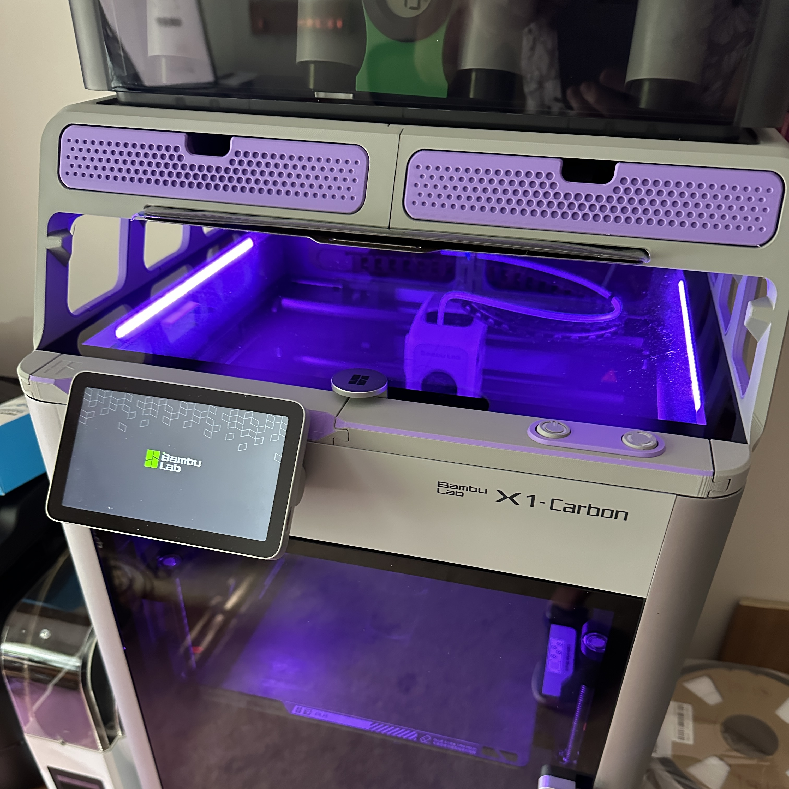
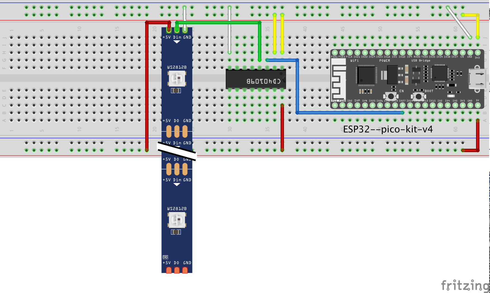
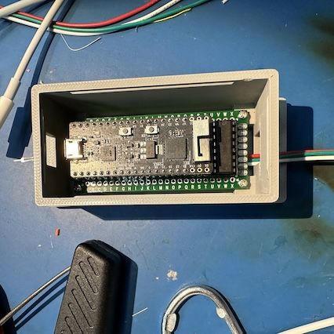
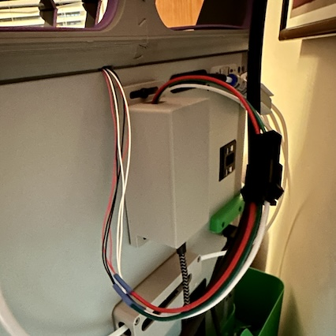
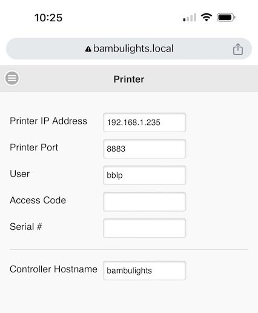
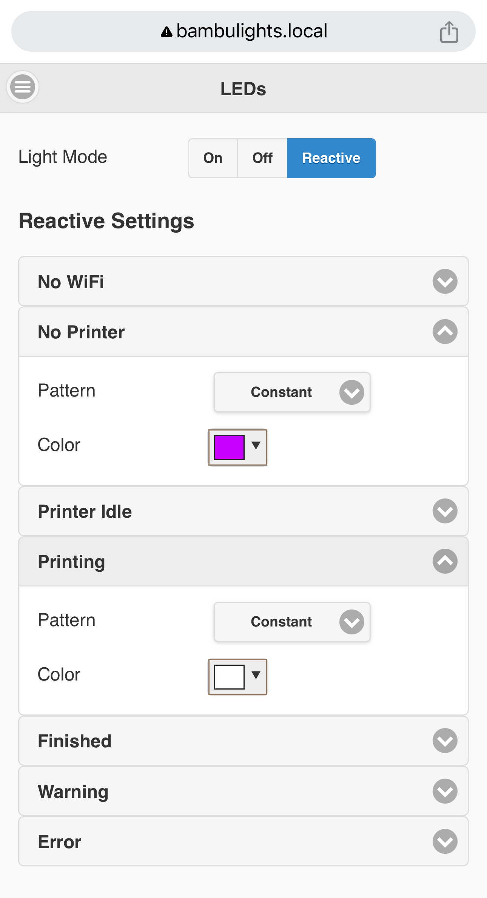
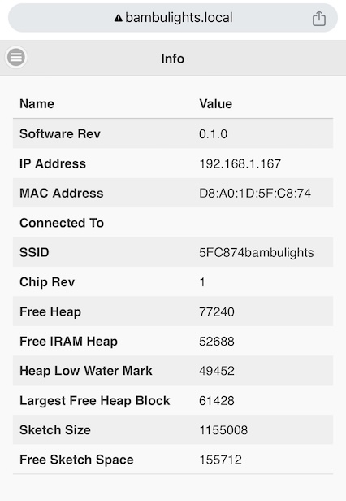

# Interface NeoPixels (aka Addressable LED Strip) with Bambu Lab Printers
I use the BV Riser with my Bambu Labs X1C that has a facility for adding additional lighting, but I also like the idea
of the BLLED project that adds lighting that reacts to the state of the printer. I can't use BLLED with the riser because
the LEDs are too big, so I developed this project which uses WS2812B LEDs to do the same thing.

## Software
This project uses PlatformIO IDE. It is easy to build and upload to the hardware if you have PlatformIO installed. Just
check out the repo and open it in PlatformIO. There are two artifacts:
- firmware.bin - the firmware!
- littlefs.bin - the GUI
When the software first runs it will create an access point that you can use to connect it to your local network.
The SSID for the access point will be some hex numbers followed by _bambulights_, for example _5FC874bambulights_.
## Hardware
The hardware is pretty simple. The LEDs take less than 0.7A total, so most ESP32 dev kits will be able to provide the
5V power for the LEDs. I used a ESP32 Pico D4 module that I happened to have lying around. The signal from these is
3.3V so I added a CD40109B level shifter. Again I happened to have one lying around, but pretty much any level shifter
would do.

This is how it is wired up:

This is the whole thing in a box I printed for it:

And attached to the back of the printer:

## GUI
There is a web GUI that allows you to configure the printer details and the colors and behaviors of the LEDs. This is
available at http://bambulights.local/ (assuming your PC/phone understands the .local suffix). When you make a
change in the GUI it will be immediately reflected in the device.

There are three screens. The first allows you to set the connection details for the printer and to change the hostname
of the device itself:

The second allows you to set the colors and effects for the different printer states, and also to force the LEDs to
be off, on (white) or reactive to the state of the printer:

The last screen is for data nerds, it shows some stats about the device itself:

