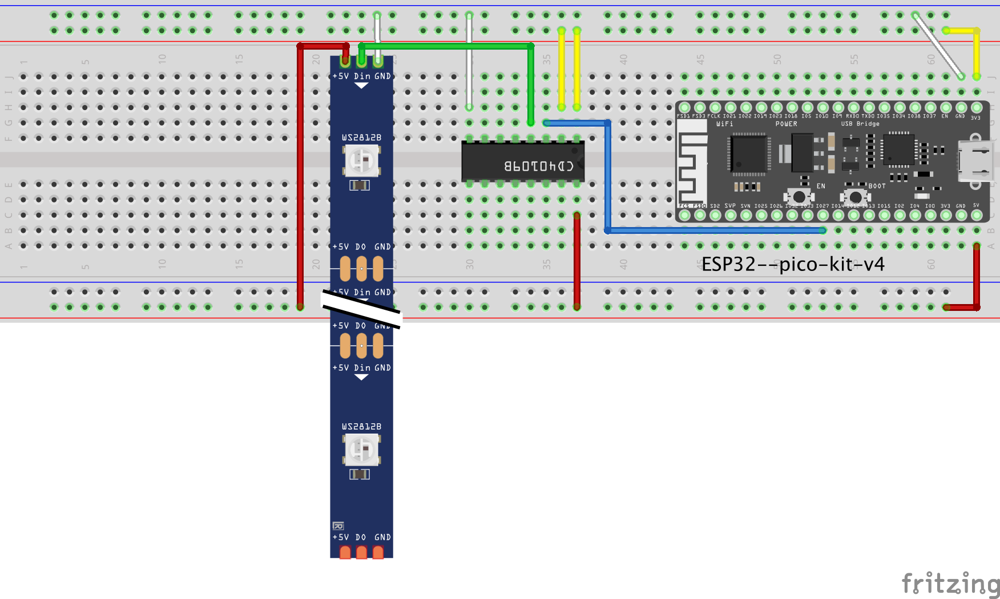

# Interface NeoPixels (aka Addressable LED Strip) with Bambu Lab Printers
I use the [BLV AMS Riser](https://makerworld.com/en/models/19535) with my Bambu Labs X1C that has a facility for adding
additional lighting, but I also like the idea of the [BLLED project](https://github.com/DutchDevelop/BLLEDController)
that adds lighting that reacts to the state of the printer. I can't use BLLED with the riser because
the LEDs are too big, but I have a lot of experience developing hardware and software that uses ESP32 and 
addressable LEDs so I developed this project to do the same thing, but for 5V WS2812B LED strips.

## Software
This project uses PlatformIO IDE. It is easy to build and upload to the hardware if you have PlatformIO installed. Just
check out the repo and open it in PlatformIO. There are two artifacts:
- firmware.bin - the firmware!
- littlefs.bin - the GUI

When the software first runs it will create an access point that you can use to connect it to your local network.
The SSID for the access point will be some hex numbers followed by _bambulights_, for example _5FC874bambulights_.
### Installing
Instead of building the software, you can install a release. Go [the latest release](https://github.com/judge2005/BambuLights/releases)
and follow the instructions.
## Hardware
The hardware is pretty simple. The LEDs take less than 0.7A total, so most ESP32 dev kits will be able to provide the
5V power for the LEDs.
### Lights
I used some [high-density WS2812B LED strips available on AliExpress](https://a.aliexpress.com/_mOUCHh0).
They are 5mm flexible LED strips with 160 LEDs/m. They have an adhesive backing so I just left the backing on
so I could slide them in to the channels in the riser. I cut them to 210mm, which is 33 LEDs. The software allows
you to specify how many LEDs you have and also change between GRB (standard for WS2812B strips) and RGB (standard for APA106 strips).

You will need to solder 28AWG hookup wire to the terminals on the strips, preferably white, red and green to match the wiring used in the original
connector. This gauge allows you to thread three wires through the channel in the riser rather than just two.

Wire the two strips in parallel.

I also bought [these JST connectors from AliExpress](https://a.aliexpress.com/_mtc1dYm) so I could easily connect/disconnect the electronics.
The wire colors match the original connector wire colors.
### Electronics
I used a [ESP32 Pico D4 devkit](https://www.amazon.com/DIYmall-ESP32-PICO-KIT-Development-Board-ESP-32/dp/B00RSPTHE0) that I happened to have lying around. The signal from these is
3.3V so I added a [CD40109B level shifter](https://www.ti.com/product/CD40109B). Again I happened to have one lying around, but pretty much any level shifter
would do.

This is how it is wired up:

This is the whole thing in a box I printed for it:

And attached to the back of the printer:

## GUI
There is a web GUI that allows you to configure the printer details and the colors and behaviors of the LEDs. This is
available at http://bambulights.local/ (assuming your PC/phone understands the .local suffix). When you make a
change in the GUI it will be immediately reflected in the device.

There are three screens. The first allows you to set the connection details for the printer and to change the hostname
of the device itself:

The second allows you to set the colors and effects for the different printer states, and also to force the LEDs to
be off, on (white) or reactive to the state of the printer:

The last screen is for data nerds, it shows some stats about the device itself:

